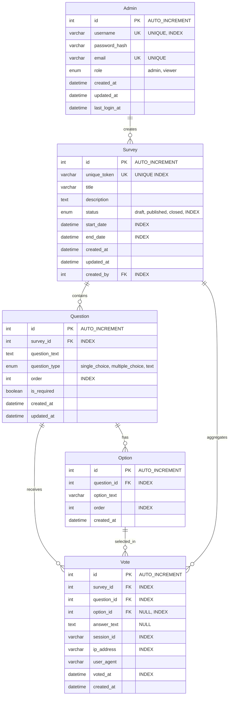

# ER図（Entity Relationship Diagram）

## データベース設計図

## リレーション説明

### 1:N リレーション

1. **Admin → Survey** (1:N)
   - 1人の管理者が複数のアンケートを作成可能
   - `Survey.created_by` → `Admin.id`

2. **Survey → Question** (1:N)
   - 1つのアンケートに複数の質問が紐付く
   - `Question.survey_id` → `Survey.id`

3. **Question → Option** (1:N)
   - 1つの質問に複数の選択肢が紐付く
   - `Option.question_id` → `Question.id`

4. **Question → Vote** (1:N)
   - 1つの質問に対して複数の投票が可能
   - `Vote.question_id` → `Question.id`

5. **Option → Vote** (1:N)
   - 1つの選択肢に対して複数の投票が可能（選択肢タイプの場合）
   - `Vote.option_id` → `Option.id` (NULL可)

6. **Survey → Vote** (1:N)
   - 1つのアンケートに対して複数の投票が可能
   - 集計クエリ高速化のため直接リレーション
   - `Vote.survey_id` → `Survey.id`

## インデックス戦略

### 主キー（Primary Key）
- すべてのテーブルに `id` を主キーとして設定

### ユニークキー（Unique Key）
- `Admin.username`: ユーザー名の重複防止
- `Admin.email`: メールアドレスの重複防止
- `Survey.unique_token`: URLトークンの重複防止

### インデックス（Index）

#### Survey テーブル
- `status`: ステータスでの検索・フィルタリング
- `start_date`, `end_date`: 公開期間での検索
- `created_by`: 作成者での検索

#### Question テーブル
- `survey_id`: アンケートに紐付く質問の取得
- `order`: 表示順序でのソート

#### Option テーブル
- `question_id`: 質問に紐付く選択肢の取得
- `order`: 表示順序でのソート

#### Vote テーブル
- `survey_id`: アンケート別の投票集計
- `question_id`: 質問別の投票集計
- `option_id`: 選択肢別の投票集計
- `session_id`: 重複投票チェック
- `ip_address`: IPアドレスでの分析
- `voted_at`: 時系列分析
- **複合インデックス**:
  - `(survey_id, question_id, option_id)`: 集計クエリ高速化
  - `(survey_id, session_id)`: 重複投票チェック高速化

## データ型詳細

### Admin テーブル
| カラム名 | データ型 | 制約 | 説明 |
|---------|---------|------|------|
| id | INT | PK, AUTO_INCREMENT | 管理者ID |
| username | VARCHAR(100) | UNIQUE, INDEX | ユーザー名 |
| password_hash | VARCHAR(255) | NOT NULL | パスワードハッシュ |
| email | VARCHAR(255) | UNIQUE | メールアドレス |
| role | ENUM | 'admin', 'viewer' | 権限 |
| created_at | DATETIME | NOT NULL | 作成日時 |
| updated_at | DATETIME | NOT NULL | 更新日時 |
| last_login_at | DATETIME | NULL | 最終ログイン日時 |

### Survey テーブル
| カラム名 | データ型 | 制約 | 説明 |
|---------|---------|------|------|
| id | INT | PK, AUTO_INCREMENT | アンケートID |
| unique_token | VARCHAR(50) | UNIQUE, INDEX | URLトークン |
| title | VARCHAR(255) | NOT NULL | タイトル |
| description | TEXT | NULL | 説明文 |
| status | ENUM | INDEX | 'draft', 'published', 'closed' |
| start_date | DATETIME | INDEX | 開始日時 |
| end_date | DATETIME | INDEX | 終了日時 |
| created_at | DATETIME | NOT NULL | 作成日時 |
| updated_at | DATETIME | NOT NULL | 更新日時 |
| created_by | INT | FK, INDEX | 作成者ID |

### Question テーブル
| カラム名 | データ型 | 制約 | 説明 |
|---------|---------|------|------|
| id | INT | PK, AUTO_INCREMENT | 質問ID |
| survey_id | INT | FK, INDEX | アンケートID |
| question_text | TEXT | NOT NULL | 質問文 |
| question_type | ENUM | NOT NULL | 'single_choice', 'multiple_choice', 'text' |
| order | INT | INDEX | 表示順序 |
| is_required | BOOLEAN | NOT NULL | 必須フラグ |
| created_at | DATETIME | NOT NULL | 作成日時 |
| updated_at | DATETIME | NOT NULL | 更新日時 |

### Option テーブル
| カラム名 | データ型 | 制約 | 説明 |
|---------|---------|------|------|
| id | INT | PK, AUTO_INCREMENT | 選択肢ID |
| question_id | INT | FK, INDEX | 質問ID |
| option_text | VARCHAR(500) | NOT NULL | 選択肢テキスト |
| order | INT | INDEX | 表示順序 |
| created_at | DATETIME | NOT NULL | 作成日時 |

### Vote テーブル
| カラム名 | データ型 | 制約 | 説明 |
|---------|---------|------|------|
| id | INT | PK, AUTO_INCREMENT | 投票ID |
| survey_id | INT | FK, INDEX | アンケートID |
| question_id | INT | FK, INDEX | 質問ID |
| option_id | INT | FK, NULL, INDEX | 選択肢ID（選択肢タイプの場合） |
| answer_text | TEXT | NULL | 回答テキスト（自由記述の場合） |
| session_id | VARCHAR(255) | INDEX | セッションID |
| ip_address | VARCHAR(45) | INDEX | IPアドレス |
| user_agent | VARCHAR(500) | NULL | ユーザーエージェント |
| voted_at | DATETIME | INDEX | 投票日時 |
| created_at | DATETIME | NOT NULL | 作成日時 |

## 制約とビジネスルール

### 外部キー制約
- `Survey.created_by` → `Admin.id` (ON DELETE RESTRICT)
- `Question.survey_id` → `Survey.id` (ON DELETE CASCADE)
- `Option.question_id` → `Question.id` (ON DELETE CASCADE)
- `Vote.survey_id` → `Survey.id` (ON DELETE CASCADE)
- `Vote.question_id` → `Question.id` (ON DELETE CASCADE)
- `Vote.option_id` → `Option.id` (ON DELETE CASCADE)

### ビジネスルール
1. **投票の整合性**
   - `question_type` が 'single_choice' または 'multiple_choice' の場合、`option_id` は必須
   - `question_type` が 'text' の場合、`answer_text` は必須
   - 同一 `session_id` と `survey_id` の組み合わせで重複投票を防止

2. **アンケートの公開**
   - `status` が 'published' かつ現在日時が `start_date` と `end_date` の間の場合のみ投票可能

3. **URLトークン**
   - `unique_token` はユニークで、ランダムな文字列（推奨: 8-12文字）

## パフォーマンス最適化

### キャッシュ対象
- アンケート情報（Survey + Question + Option）: Redisにキャッシュ
- 集計結果: リアルタイム更新時のみ無効化

### パーティショニング（オプション）
- Voteテーブルを `voted_at` で日付パーティショニング（大量データ時）

### 読み取り専用レプリカ（オプション）
- ダッシュボード用の読み取り専用レプリカを用意

---

**作成日**: 2024年
**バージョン**: 1.0
**関連ドキュメント**: 要件定義書.md

