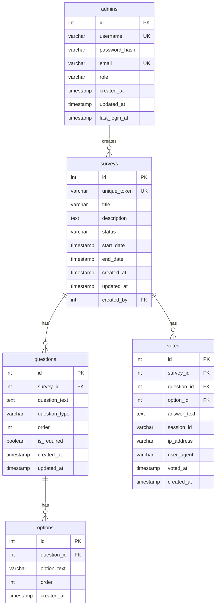
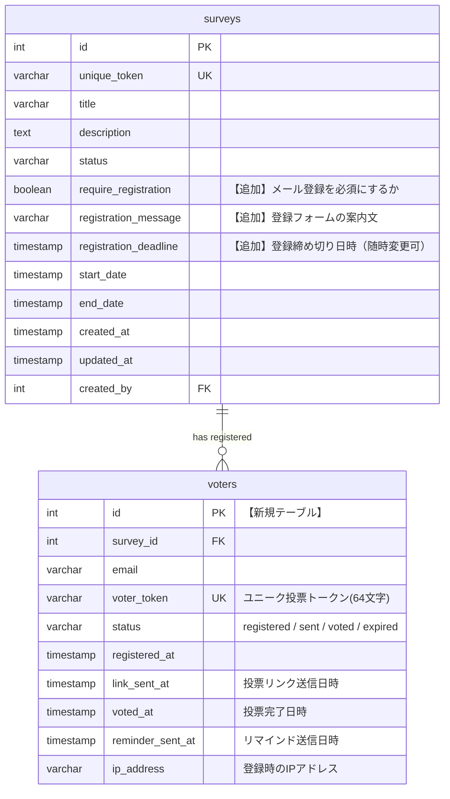
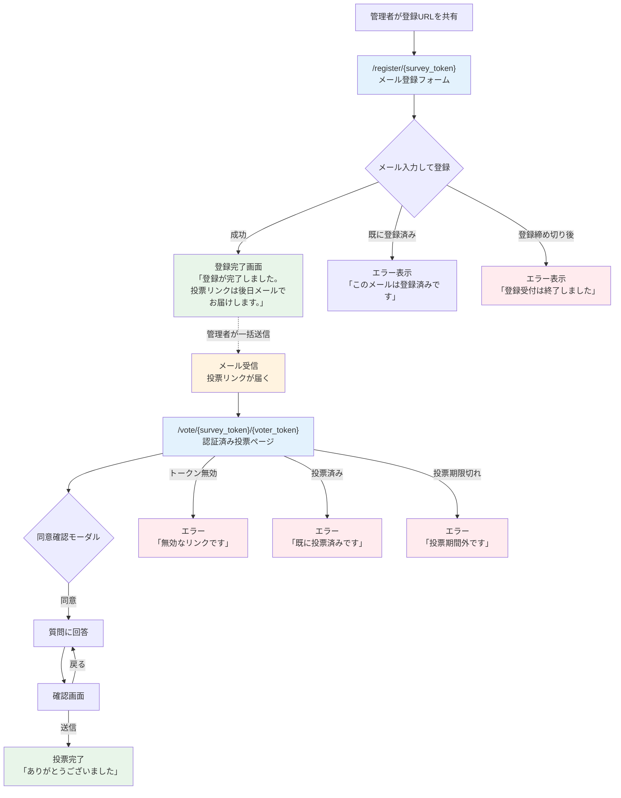
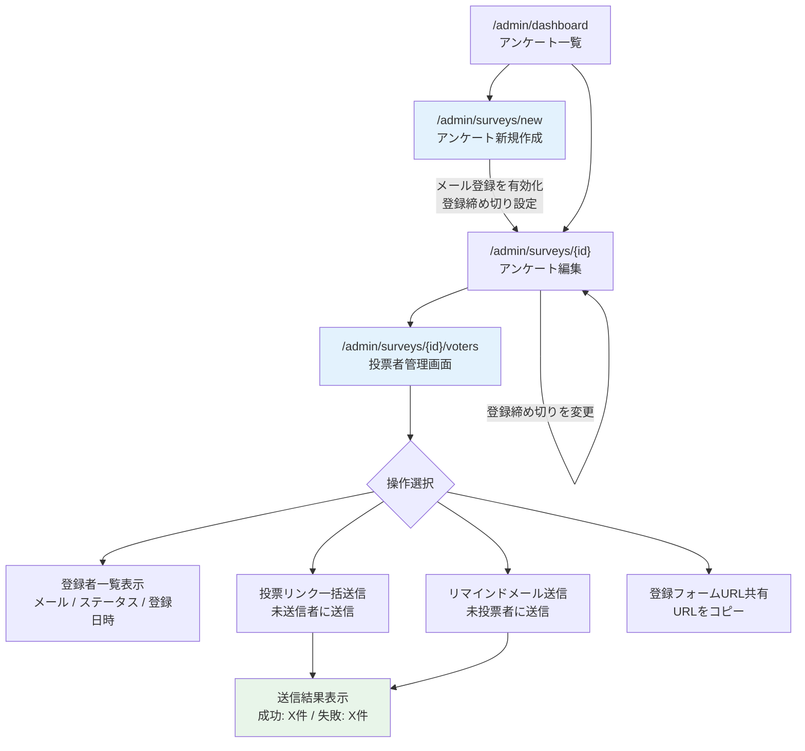
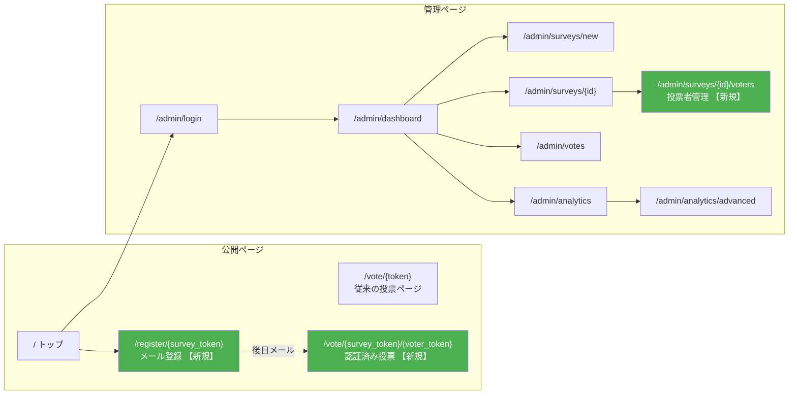
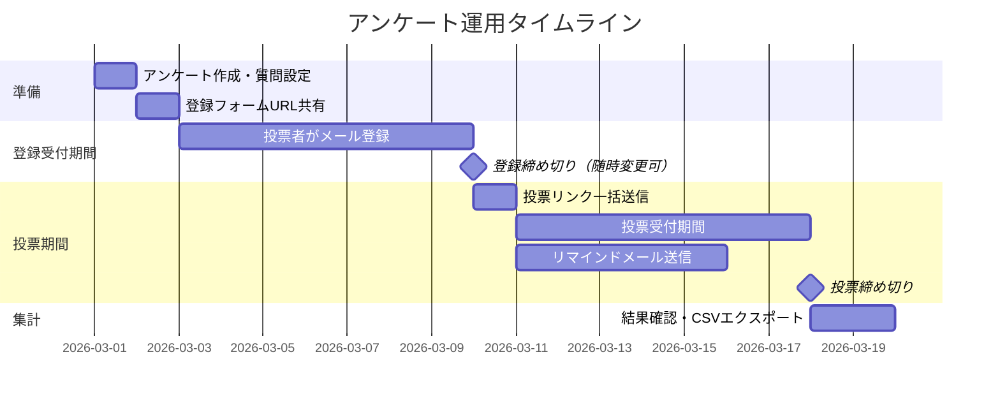

# メール認証投票機能 設計書

## 1. 概要

### 1.1 目的
現状のアンケートシステムに「メール登録 → ユニークリンク発行 → 1人1票の保証」機能を追加し、選挙投票レベルの信頼性を実現する。

### 1.2 現状の課題
- 投票URLを知っている人は誰でも投票可能
- 重複投票の防止がlocalStorage（session_id）に依存しており、容易に回避可能
- 誰が投票したかの追跡ができない

### 1.3 解決策
Resendによるメール配信と、1人1つのユニーク投票トークンにより「選挙権」を管理する。

### 1.4 設計方針
- **完全匿名投票**: 投票内容と投票者を技術的にも紐付けない
- **投票者自己登録**: 投票者が自分でメールアドレスを登録する（管理者による一括登録は初期リリース対象外）
- **管理者主導の送信**: 投票リンクの送信タイミングは管理者がコントロール
- **後方互換**: 従来のURL共有方式も引き続き使用可能

---

## 2. 現状システム構成

### 2.1 既存の技術スタック

| レイヤー | 技術 | ホスティング |
|----------|------|-------------|
| フロントエンド | Next.js 13 (App Router) + Tailwind CSS | Vercel |
| バックエンド | Express.js + TypeScript | Railway |
| DB | PostgreSQL 15 | Railway |
| キャッシュ | Redis 7 | Railway |
| リアルタイム | Socket.IO | Railway |
| メール配信 | **Resend**（新規追加） | 外部API |

### 2.2 既存ページ一覧

| ルート | 用途 | 認証 | 変更 |
|--------|------|------|------|
| `/` | トップページ | 不要 | なし |
| `/vote/[token]` | 投票ページ（従来方式） | 不要 | なし |
| `/admin/login` | ログイン | 不要 | なし |
| `/admin/dashboard` | アンケート一覧 | 必要 | なし |
| `/admin/surveys/new` | アンケート新規作成 | 必要 | **改修** |
| `/admin/surveys/[id]` | アンケート編集 | 必要 | **改修** |
| `/admin/votes` | 投票データ閲覧 | 必要 | なし |
| `/admin/analytics` | リアルタイム分析 | 必要 | なし |
| `/admin/analytics/advanced` | 高度な分析 | 必要 | なし |

### 2.3 既存APIエンドポイント

| メソッド | パス | 用途 | 変更 |
|----------|------|------|------|
| POST | `/api/v1/auth/login` | ログイン | なし |
| GET | `/api/v1/auth/me` | 認証確認 | なし |
| GET | `/api/v1/surveys` | アンケート一覧 | なし |
| GET | `/api/v1/surveys/token/:token` | 公開アンケート取得 | なし |
| GET | `/api/v1/surveys/:id` | アンケート詳細 | なし |
| POST | `/api/v1/surveys` | アンケート作成 | なし |
| PUT | `/api/v1/surveys/:id` | アンケート更新 | なし |
| DELETE | `/api/v1/surveys/:id` | アンケート削除 | なし |
| POST | `/api/v1/surveys/:id/regenerate-token` | トークン再発行 | なし |
| GET | `/api/v1/surveys/:id/export/csv` | CSVエクスポート | なし |
| GET | `/api/v1/questions` | 質問一覧 | なし |
| POST | `/api/v1/questions` | 質問作成 | なし |
| PUT | `/api/v1/questions/:id` | 質問更新 | なし |
| DELETE | `/api/v1/questions/:id` | 質問削除 | なし |
| POST | `/api/v1/questions/:id/options` | 選択肢作成 | なし |
| PUT | `/api/v1/questions/options/:id` | 選択肢更新 | なし |
| DELETE | `/api/v1/questions/options/:id` | 選択肢削除 | なし |
| POST | `/api/v1/votes` | 投票送信 | **改修** |
| GET | `/api/v1/votes` | 投票データ一覧 | なし |
| GET | `/api/v1/admin/analytics/*` | 分析データ | なし |

---

## 3. 追加機能の設計

### 3.1 新規ページ

| ルート | 用途 | 認証 | 新規/改修 |
|--------|------|------|-----------|
| `/register/[survey_token]` | 投票者メール登録フォーム | 不要 | **新規** |
| `/vote/[survey_token]/[voter_token]` | 認証済み投票ページ | voter_token | **新規** |
| `/admin/surveys/[id]/voters` | 投票者管理画面 | 必要 | **新規** |

### 3.2 新規APIエンドポイント

| メソッド | パス | 用途 | 新規/改修 |
|----------|------|------|-----------|
| POST | `/api/v1/voters/register` | 投票者メール登録 | **新規** |
| GET | `/api/v1/voters/verify/:voter_token` | 投票トークン検証 + アンケート取得 | **新規** |
| GET | `/api/v1/voters?survey_id=X` | 投票者一覧（管理者） | **新規** |
| POST | `/api/v1/voters/send-links` | 投票リンク一括送信（管理者） | **新規** |
| POST | `/api/v1/voters/remind` | リマインドメール送信（管理者） | **新規** |

---

## 4. ER図

### 4.1 既存テーブル（変更なし）



### 4.2 変更・追加テーブル



**注意: votes テーブルに voter_id は追加しない（完全匿名投票）**

投票済みの管理は `voters.status = 'voted'` のみで行い、投票内容と投票者を技術的にも紐付けない。

### 4.3 新規テーブル定義: voters

```sql
CREATE TABLE IF NOT EXISTS voters (
    id SERIAL PRIMARY KEY,
    survey_id INTEGER NOT NULL REFERENCES surveys(id) ON DELETE CASCADE,
    email VARCHAR(255) NOT NULL,
    voter_token VARCHAR(64) UNIQUE NOT NULL,
    status VARCHAR(20) NOT NULL DEFAULT 'registered'
        CHECK (status IN ('registered', 'sent', 'voted', 'expired')),
    registered_at TIMESTAMP DEFAULT CURRENT_TIMESTAMP,
    link_sent_at TIMESTAMP,
    voted_at TIMESTAMP,
    reminder_sent_at TIMESTAMP,
    ip_address VARCHAR(45),
    UNIQUE(survey_id, email)  -- 同一アンケートに同じメールは1回のみ
);

CREATE INDEX idx_voters_survey_id ON voters(survey_id);
CREATE INDEX idx_voters_email ON voters(email);
CREATE INDEX idx_voters_voter_token ON voters(voter_token);
CREATE INDEX idx_voters_status ON voters(status);
```

### 4.4 既存テーブルの変更

```sql
-- surveys テーブルにカラム追加
ALTER TABLE surveys ADD COLUMN require_registration BOOLEAN NOT NULL DEFAULT false;
ALTER TABLE surveys ADD COLUMN registration_message TEXT;
ALTER TABLE surveys ADD COLUMN registration_deadline TIMESTAMP;
```

---

## 5. 画面遷移図

### 5.1 投票者側フロー



### 5.2 管理者側フロー



### 5.3 全体画面遷移図



### 5.4 タイムライン



---

## 6. メール配信設計

### 6.1 利用サービス
**Resend** (https://resend.com)
- 無料枠: 月3,000通
- SDK: `resend` npm パッケージ
- 送信元ドメイン: お名前.comで取得した独自ドメイン

### 6.2 ドメイン設定手順
1. Resendアカウント作成（GitHub連携）
2. Resend管理画面でドメインを追加
3. お名前.comのDNS設定で以下を追加:
   - TXT（DMARC）
   - TXT（DKIM）
   - MX（メール送信用）
4. Resendで「Verify」→ 緑の「Verified」確認

### 6.3 必要な環境変数

```env
RESEND_API_KEY=re_xxxxxxxxxxxx
MAIL_FROM=noreply@yourdomain.com
```

### 6.4 メールテンプレート

#### 投票リンク送信メール
```
件名: 【{アンケートタイトル}】投票のご案内

以下のアンケートへの投票が可能になりました。

■ アンケート名: {タイトル}
■ 説明: {説明文}
■ 投票期限: {end_date}

下記のリンクから投票してください（1回のみ有効）:
{投票URL}

※このリンクはあなた専用です。他の方への転送はお控えください。
※1度投票すると、リンクは無効になります。
```

#### リマインドメール
```
件名: 【リマインド】{アンケートタイトル} まだ投票されていません

まだ投票がお済みでないようです。

■ アンケート名: {タイトル}
■ 投票期限: {end_date}

以下のリンクから投票してください:
{投票URL}
```

---

## 7. API詳細設計

### 7.1 POST `/api/v1/voters/register`
投票者がメールアドレスを登録する。

**リクエスト:**
```json
{
  "survey_token": "aa318580a943",
  "email": "voter@example.com"
}
```

**レスポンス (201):**
```json
{
  "message": "登録が完了しました。投票リンクは後日メールでお届けします。"
}
```

**バリデーション:**
- メールアドレス形式チェック（Zod）
- survey_tokenの存在確認
- アンケートの `require_registration = true` 確認
- アンケートの `status = 'published'` 確認
- `registration_deadline` を過ぎていないか確認
- 同一アンケート・同一メールの重複チェック

**エラー:**
- 400: メールアドレスが不正
- 403: アンケートが非公開 / メール登録が無効 / 登録締め切り後
- 404: アンケートが見つからない
- 409: 既に登録済み

**レート制限:** 1IPあたり15分で5回まで

### 7.2 GET `/api/v1/voters/verify/:voter_token`
投票トークンを検証し、アンケートデータを返す。

**レスポンス (200):**
```json
{
  "voter": {
    "email": "vo***@example.com",
    "status": "sent"
  },
  "survey": {
    "id": 17,
    "title": "模擬選挙アンケート（テスト）",
    "questions": [...]
  }
}
```

**チェック項目:**
1. voter_tokenがDBに存在するか
2. voters.statusが `voted` でないか
3. 紐づくアンケートが `published` かつ投票期間内か

**エラー:**
- 404: トークン無効
- 403: 既に投票済み / アンケート終了 / 投票期間外

### 7.3 POST `/api/v1/voters/send-links` (管理者)
未送信（status = 'registered'）の登録者に投票リンクメールを一括送信。

**リクエスト:**
```json
{
  "survey_id": 17
}
```

**レスポンス (200):**
```json
{
  "sent": 45,
  "failed": 2,
  "already_sent": 10,
  "errors": ["voter@invalid.com: メール送信失敗"]
}
```

**処理:**
1. survey_idで `status = 'registered'` のvotersを取得
2. 各voterにResend経由でメール送信
3. 成功した場合 `status = 'sent'`, `link_sent_at = now` に更新
4. 結果を集計して返却

### 7.4 POST `/api/v1/voters/remind` (管理者)
未投票者（status = 'sent'）にリマインドメールを送信。

**リクエスト:**
```json
{
  "survey_id": 17
}
```

**レスポンス (200):**
```json
{
  "sent": 20,
  "failed": 1,
  "already_voted": 25
}
```

### 7.5 GET `/api/v1/voters?survey_id=X` (管理者)
投票者一覧を取得。

**レスポンス (200):**
```json
{
  "voters": [
    {
      "id": 1,
      "email": "tanaka@example.com",
      "status": "voted",
      "registered_at": "2026-03-01T10:00:00Z",
      "link_sent_at": "2026-03-08T09:00:00Z",
      "voted_at": "2026-03-08T14:30:00Z"
    }
  ],
  "summary": {
    "total": 50,
    "registered": 5,
    "sent": 20,
    "voted": 25
  }
}
```

### 7.6 POST `/api/v1/votes` (改修)
既存の投票APIに `voter_token` パラメータを追加。

**リクエスト (変更後):**
```json
{
  "survey_token": "aa318580a943",
  "question_id": 31,
  "option_id": 1,
  "voter_token": "abc123def456..."
}
```

**処理フロー変更:**
1. アンケートを取得
2. `survey.require_registration === true` の場合:
   - `voter_token` 必須。なければ403
   - voter_tokenでvotersテーブルを検索
   - `status === 'voted'` なら拒否
   - 全質問の回答完了後に `voters.status = 'voted'`, `voters.voted_at = now` に更新
3. `survey.require_registration === false` の場合:
   - 従来通りsession_idで重複チェック（後方互換）

---

## 8. ファイル構成

### 8.1 新規ファイル

```
backend/src/
├── models/
│   └── Voter.ts              【新規】Voterモデル
├── routes/
│   └── voters.ts             【新規】投票者管理API
└── services/
    └── mail.ts               【新規】Resendメール送信サービス

frontend/src/app/
├── register/
│   └── [survey_token]/
│       └── page.tsx           【新規】メール登録フォーム
├── vote/
│   └── [survey_token]/
│       └── [voter_token]/
│           └── page.tsx       【新規】認証済み投票ページ
└── admin/
    └── surveys/
        └── [id]/
            └── voters/
                └── page.tsx   【新規】投票者管理画面
```

### 8.2 改修ファイル

```
backend/src/
├── routes/
│   └── votes.ts              【改修】voter_token検証ロジック追加
├── index.ts                  【改修】voterルート追加
└── database/
    └── migrate.ts            【改修】マイグレーション追加

frontend/src/
├── app/admin/surveys/
│   ├── new/page.tsx           【改修】メール登録必須オプション追加
│   └── [id]/page.tsx          【改修】メール登録設定・登録締め切り設定追加
└── lib/
    └── api.ts                 【改修】voter API追加
```

---

## 9. セキュリティ設計

| 項目 | 対策 |
|------|------|
| voter_token | `crypto.randomUUID()` + SHA-256ハッシュで64文字のトークン生成 |
| メール重複 | `(survey_id, email)` にUNIQUE制約 |
| 1人1票 | voter_token検証 + status='voted'チェック |
| 完全匿名 | votes テーブルに voter_id を保持しない。投票内容と投票者の紐付けは不可能 |
| トークン推測防止 | 64文字のランダムトークン（十分なエントロピー） |
| レート制限 | メール登録: 1IP/15分あたり5回まで |
| メール検証 | Zodバリデーション |
| 個人情報保護 | メールアドレスは管理者のみ閲覧可能 |
| メール送信元 | お名前.com独自ドメイン + SPF/DKIM認証（迷惑メール対策） |

---

## 10. 実装フェーズ

### Phase 1: DB・バックエンド基盤（0.5日）
- [ ] voters テーブル作成（マイグレーション）
- [ ] surveys テーブルにカラム追加（require_registration, registration_message, registration_deadline）
- [ ] Voter モデル実装
- [ ] Resend SDK セットアップ + メール送信サービス

### Phase 2: 投票者登録フロー（0.5日）
- [ ] POST `/api/v1/voters/register` 実装
- [ ] GET `/api/v1/voters/verify/:voter_token` 実装
- [ ] `/register/[survey_token]` 登録フォームページ

### Phase 3: 認証済み投票フロー（0.5日）
- [ ] `/vote/[survey_token]/[voter_token]` 認証済み投票ページ
- [ ] POST `/api/v1/votes` 改修（voter_token検証）
- [ ] 投票後のvoterステータス更新（完全匿名を維持）

### Phase 4: 管理者機能（0.5日）
- [ ] GET `/api/v1/voters` 投票者一覧API
- [ ] POST `/api/v1/voters/send-links` 一括送信API
- [ ] POST `/api/v1/voters/remind` リマインドAPI
- [ ] `/admin/surveys/[id]/voters` 投票者管理画面
- [ ] アンケート作成/編集画面に「メール登録必須」「登録締め切り」オプション追加

### Phase 5: テスト・デプロイ（0.5日）
- [ ] E2Eテスト（登録 → メール受信 → 投票の一連フロー）
- [ ] Railway環境変数設定（RESEND_API_KEY, MAIL_FROM）
- [ ] Vercel再デプロイ
- [ ] 本番動作確認

---

## 11. 環境変数の追加

### Railway（バックエンド）
```env
RESEND_API_KEY=re_xxxxxxxxxxxx
MAIL_FROM=noreply@yourdomain.com
FRONTEND_URL=https://anke-to-seijigyousei2.vercel.app
```

### 必要なnpmパッケージ
```bash
npm install resend zod
```

---

## 12. 後方互換性

- `require_registration = false`（デフォルト）のアンケートは従来通りURL共有で投票可能
- 既存の `/vote/[token]` ルートはそのまま動作
- 新機能は `require_registration = true` のアンケートのみに適用
- 既存の投票データには影響なし
- 既存のAPI仕様は変更なし（`voter_token` パラメータは任意）
